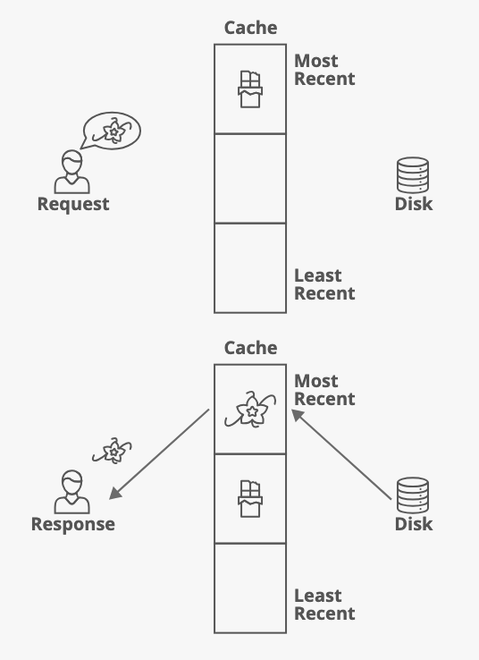
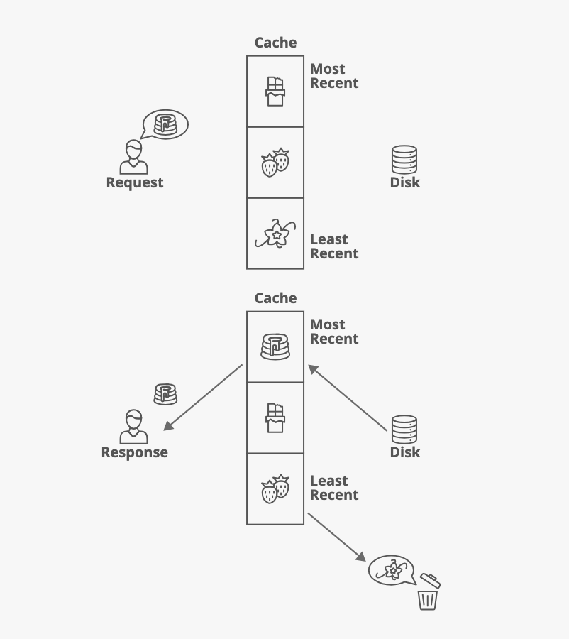

# LRU Cache

This repository contains a comprehensive guide to my over engineered implementation of a Least Recently Used (LRU) cache data structure in Motoko based on this [quick reference](https://www.interviewcake.com/concept/java/lru-cache). I designed this cache for my regex engine but I may not even use it, instead having it waste away in my documents I decide to share it with the community.

An **LRU Cache** organizes items in the order of their usage, allowing you to efficiently identify which item hasn't been used for the longest amount of time. Imagine a clothes rack, where clothes are always hung on one side. To find the least-recently used item, you look at the item on the other end of the rack.

## Overview

This **LRU Cache** implementation utilizes a combination of a `HashMap` and a custom `Node` structure **(Doubly Linked List)** to ensure efficient operations. It provides fast access to cached items, automatic eviction of the least recently used items when the cache reaches its defined capacity, and various utility functions for cache management.

### Key Features

- **Efficient Access and Updates:** Items are organized from most-recently used to least-recently used, ensuring that cache hits and updates are fast.
- **Automatic Eviction:** Once the cache reaches capacity, the least recently used item is automatically evicted to make space for new items.
- **Flexible:** Users can set an optional eviction callback, get cache statistics, resize the cache, and perform bulk operations.

## Strengths and Weaknesses

### Strengths

- **Fast Accesses:** The cache stores items in order from most-recently used to least-recently used, meaning both retrieval and insertion operations are performed in **O(1)** time.
  
- **Fast Updates:** Each time an item is accessed or added, the cache updates its internal structure (hash map and DoubleLinkedList) in **O(1)** time, making it efficient for frequently accessed data.

### Weaknesses

- **Space Overhead:** The cache requires **O(n)** space, with two data structures: a `HashMap` for fast lookups and a `Node` for tracking access order. This is more space-heavy compared to simpler cache implementations that only require a single structure.

### Functions

| Function                      | Description                                                                                                                                                        | Time Complexity | Space Complexity | Return Type |
|-------------------------------|--------------------------------------------------------------------------------------------------------------------------------------------------------------------|-----------------|------------------|-------------|
| `get(key, ?callback)`| Retrieves a value and optionally modifies it using a callback.| O(1) | O(1) | `?V`|
| `put(key, value)`| Adds or updates a key-value pair. If the cache is at capacity, it evicts the least recently used item. | O(1) | O(1)| `()` |
| `evict()`| Kicks out the least recently used item. No second chances here! | O(1) | O(1) | `()`|
| `setEvictionCallback(?callback)`| Sets an eviction callback that will be triggered whenever an eviction occurs. | O(1) | O(1) | `()`|
| `resize(newCap)`| Resizes the cache to a new capacity. It will evict items if necessary.| O(n) | O(1) | `()`|
| `clear()`| Resets the cache. | O(1) | O(1) | `()`|
| `showCache()`| Displays the current cache items in order, from most recently used to least recently used. | O(n) | O(n) | `[V]`|
| `getStats()`| Provides cache statistics like hits, misses, and evictions.| O(1) | O(1)| `CacheStats`|
| `putAll(entries)`| Inserts all key-value pairs from an iter.| O(n) | O(n) | `()`|
| `size()`| Returns the current size of the cache| O(1) | O(1)| `Nat`|
| `toIter()`| Returns an iterator over the cache| O(n)| O(n)| `Iter<(K, V)>` |

### Example Usage


```motoko
import LRU "LRU";
import Text "mo:base/Text";

actor {

  public func runExample() :async [Text]{

    // Create an LRU cache with space for 3 recipes
    //You must provide your own equality and hash functions

    let cache = LRU.LRU<Text, Text>(3, Text.equal, Text.hash);

    // First request: Chocolate Cake
    cache.put("recipe1", "Chocolate Cake");
    //Cache : [Chocolate Cake]
```


```motoko
    // Second request: Vanilla Cake
    cache.put("recipe2", "Vanilla Cake");
    //Cache : [Vanilla Cake, Chocolate Cake]
```



```motoko
    // Third request: Strawberry Cake
    cache.put("recipe3", "Strawberry Cake");
    //Cache : [Strawberry Cake, Vanilla Cake, Chocolate Cake]
```


```motoko
    // Fourth request: Chocolate Cake (again)
    ignore cache.get("recipe1", null);
    //Cache : [Chocolate Cake, Strawberry Cake, Vanilla Cake]
```


```motoko
    // Fifth request: Pound Cake (evicts Vanilla Cake)
    cache.put("recipe4", "Pound Cake");
    //Cache : [Pound Cake,Chocolate Cake, Strawberry Cake]
    
    cache.showCache();
    // [Pound Cake, Chocolate Cake, Strawberry Cake]
  };
  
};
```


